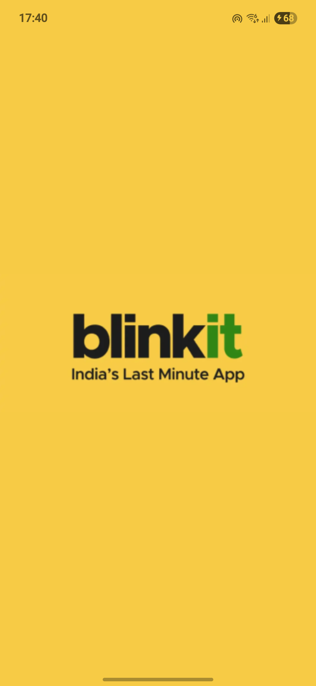
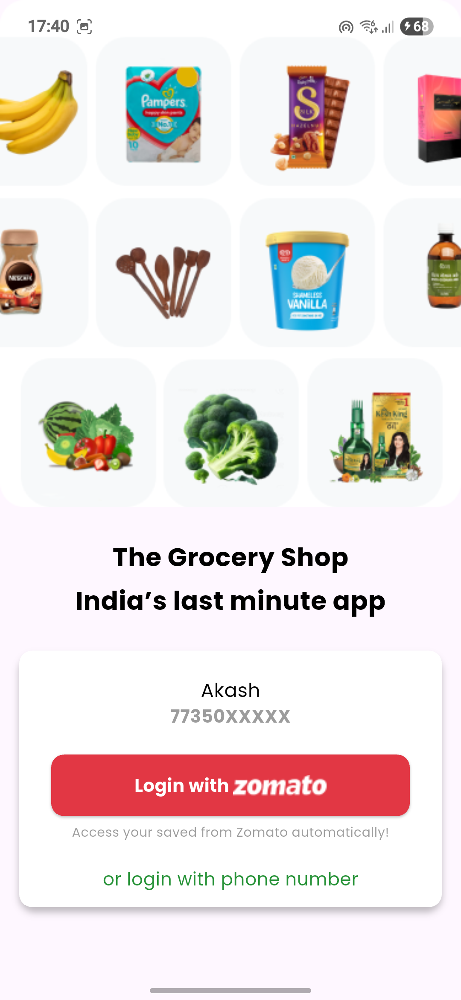
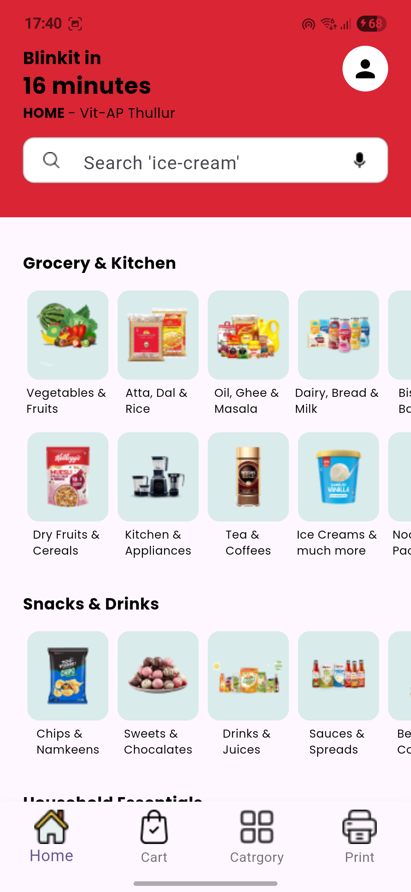
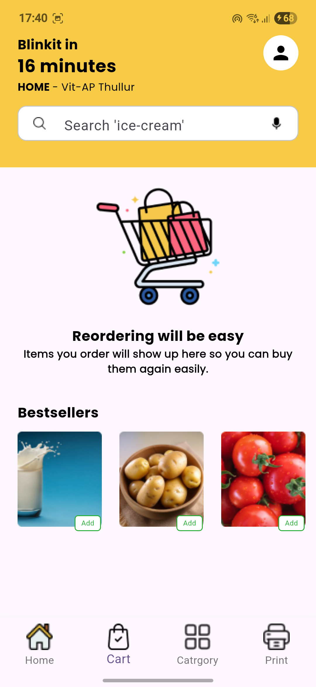
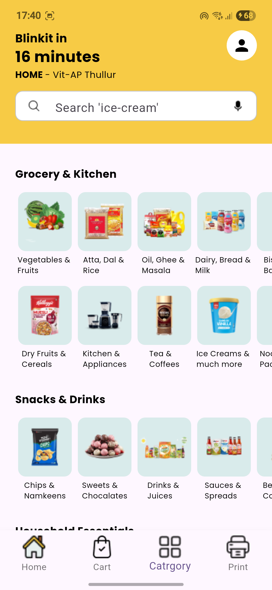
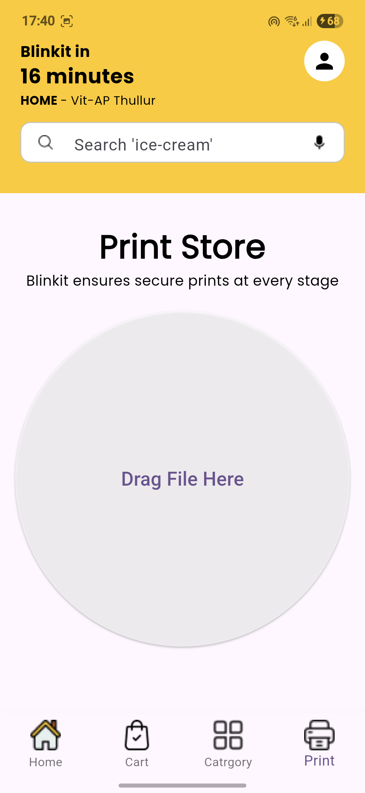

# 🛒 Blinkit UI (Flutter)

A clean and modern **Flutter UI** inspired by the **Blinkit grocery delivery app**.  
This project focuses purely on **frontend design and layout**, providing a sleek, reusable foundation for future grocery or e-commerce app development.

---

## ✨ Features

-  Beautiful, minimal UI inspired by Blinkit  
-  Responsive design compatible with all screen sizes  
-  Integrated search bar and product/category views  
-  Clean grid and list layouts for products  
-  Built using Flutter’s modern UI components  

---

##  Purpose

This project is **UI-only** — no backend or Firebase integration.  
It’s meant for:
- Learning Flutter UI and layout concepts  
- Building prototypes for grocery or shopping apps  
- Serving as a design reference for future Flutter projects  

---

##  Getting Started

1. **Clone the repository**
   ```bash
   git clone https://github.com/AKASH-KUMAR-BARPANDA/Blinkit-UI.git
## 📸 Screenshots  

Here’s a quick look at the **Blinkit UI** screens and design flow:  

<p align="center">
  
  
  
</p>

<p align="center">
  
  
  
</p>


